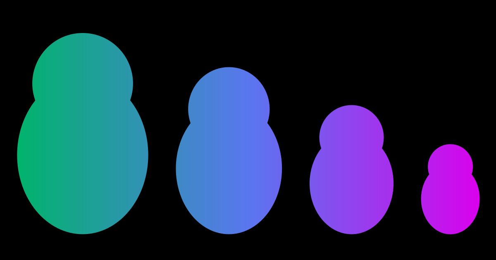

# How to Deal with Content Sharks

> This is a living document to fight against the content-thieves/copyright-infringement, I'll be updating this once in a while to keep up with the latest updates. Note: I'm not a lawyer, and this is not a legal advice. But a way for you to understand just the basics. If you want legal advice please consider contacting a lawyer near you.

## Quick Intro into Content Creation & Digital Content Creators
The act of creating different types of creative works to promote something. People post different types of content on social media to interact with their followers, but what is being referred to here is the content that is used to market something to a digital audience. Most often it is to promote a business or a service.

Different platforms are used by digital content creators to promote their creative works. Most widely known content publishing platforms are:
* Social Media
* Blogs
* Podcasts
* Video Platforms
* Case Studies
* White Papers
* Infographics

Digital Content Creators focus on promoting their creative works for:
* Marketing
* Public Relations
* Business
* Journalism
* Literature
* Media & Entertainment

Most widely used content types are of the follows:
* Texts
* Graphical
* Videos
* Audios

There are two main types of content creation tools, which are Cloud based Content Creation & On-premise Content Creation. And the Content creators are often affiliated with either a Large Enterprise or a Small & Medium Enterprise (SME).

You might have seen different types of content promoting different services of different market industries such as:
* IT & Telecom
* Travel & Hospitality
* Retail
* Education
* Healthcare
* Media & Entertainment

As a content creator, you might be often trying to increase engagement and reach of your creative media works. Promoting different services and products are mostly how different content creators earn revenue for their efforts.

As a content creator you also have liabilities. You have to keep engaging your audience or you might lose engagement. But that's not all. You should have an eye out to keep the content sharks out.

## The Content Sharks who steals your creative works
Now for the fun part. Actually it's not all fun, it's soo stressful & tiring to deal with the content thieves. The ones who tries to use your hard work and earn revenue for themselves without crediting you. It's a quick way for the thieves to earn profit under your name. Sometimes, you might have to deal with someone much more popular than you, who has a bigger network & a wider reach. And if you don't have any security system protecting your creative works, you are vulnerable to getting your profits reaped by someone else.

Sometimes people using your content for promotion won't hurt your marketing efforts. And most often you gain traffic from the people who tries to use your creative works. But when people tries to use your work without giving any attribution and says it's their own independent efforts, that calls for a copyright violation issue. This is where the difference between content usage and content stealing comes.

Creators have bird eye view over their audience. And sometimes they try to copy your work, saying it's their and tries to earn profit on your behalf. And without any attribution you are losing any profits that was rightfully yours. I'm not saying all content creators are like that, but there are people who do this. I have seen and experienced this in the frontlines. And this article is a type of guidelines to fight against the people stealing content.

And if you are one of the accidental content thief, just give us some credit in your use. So that we may keep producing content for you and the actual audience. This is just my opinion. Not everyone would be readily agree for you to use their content. So probably ask them first, if it's okay to use it for your personal or commercial use. I believe most content creator would want to have other people using their creative works, to gain a wider reach, which was not available to them before on their own network.

## How to prevent people from stealing your content?
Some of these points are solely available to use on a specific platform. Some social media such as Instagram doesn't have clickable links. It's a way for the users to stay within the application and not leave to a 3rd party platform. It's said to be a security feature. But being able to have an option to still continue your marketing efforts outside a single platform would give you more autonomy.

> I once had [my X (Twitter) account](https://twitter.com/htmldecoder) banned as I retweeted some Cyber Security content. After clarifying with staff that I was not spamming or abusing the platform, I was able to revoke the banned status. It was then I realized I need to have a platform where I could be myself, without getting concerned if what I'm speaking is against the community guidelines. Also using your own platform, gives you the freedom to earn more revenue.

So, how do you actually fight against the people stealing your content? These are a few points I have identified to reduce content stealing efforts. Note that you can't completely stop people from stealing your content, but these steps could reduce their efforts in trying to steal your efforts.
* Have a system in place where you could track your followers. To find where a traffic is coming from. It not only helps in identifying these violators but also gives you an insight into how good your marketing efforts are.
* You could also use internal links to link within your marketing platform. This helps you in keeping the audience stay engaged with your content. People who tries to steal your content are too lazy to even notice these internal links. And if they copy without modifying these internal links you are able to investigate the unknown traffic coming into your platform.
* You could set a copy trigger alert to notify you when someone tries to copy the content from your page.
* You can use [DMCA](https://www.dmca.com/) or [Copyscape](https://www.copyscape.com/) badge on your website to inform users that your content is protected.
* Create a content usage guidelines for audience to use and share your content ethically.
* If you suspect someone to have stolen your content, gather proofs (screenshots) and submit a DMCA takedown notice.
* You could also get a free consultation from an Intellectual Property Lawyer and file a lawsuit.

For social media specific prevention strategies:
* Once you are aware of the similar content part of your network, you could deny them further access by blocking them. Gather proofs from your marketing analysis tools for the traffic that leads to the similar content's network. And submit a DMCA takedown notice.

## Case Studies
### Getty Images sued AI art generator Stable Diffusion for CopyRight Infringement
Stable Diffusion generated AI art which contained Getty Images watermark. It was then they realized, Stable Diffusion was using their licensed images. Even though it was transformed, there were cases where Getty images watermark appears on their generated art. Getty images have granted license to use their images to different AI generator. But Stable Diffusion was doing this without permission. This was an ongoing lawsuit.
#### Read More
* [Copyright Infringement Lawsuit in the US covered by Verge](https://www.theverge.com/2023/2/6/23587393/ai-art-copyright-lawsuit-getty-images-stable-diffusion)
* [Stable Diffusion goes to trial against Stable Diffusion for Copyright Infringement Lawsuit in the UK](https://www.msn.com/en-us/money/companies/getty-lawsuit-against-stability-ai-to-go-to-trial-in-the-uk/ar-AA1l01Oz)
### A Free Software under GPL license was modified and used by a company internally to promote their services
Recently I read in a forum (link will publish soon), about a free software used by a company internally for promoting their services. As soon as the community was made aware of the violation against GPL license. The company was prompted to publish their privately held altered-free software source for the public.

## Further Resources
* https://blog.hubspot.com/marketing/state-of-content-marketing-infographic
* https://blog.hubspot.com/marketing/internet-content-theft
* https://blog.hubspot.com/marketing/ethically-steal-content-marketing-ideas
* https://www.futuremarketinsights.com/reports/content-creation-market
* https://influencermarketinghub.com/habits-content-creators/
* https://www.contentpowered.com/blog/prevent-blog-posts-stolen/
* https://moz.com/blog/whats-fair-about-fair-use-defending-a-copyright-infringement-claim
* https://www.socialsavvyhq.co/resources/how-to-catch-content-thieves
