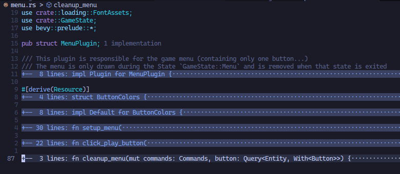
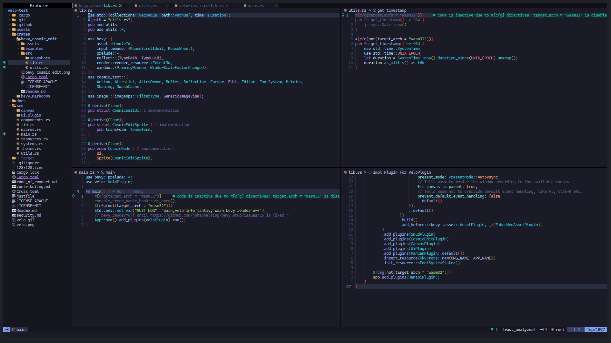

# Contributing to an opensource learning project built using Rust's Bevy game engine
Recently I stubled upon an issues [in April's this-week-in-rust.org's call for participation section](https://this-week-in-rust.org/blog/2023/04/26/this-week-in-rust-492/#call-for-participation).  The issue was of an [Rust learning project - Velo](https://github.com/StaffEngineer/velo), a learning app project for brainstorming. As I was planning to get familar with game development technologies I loved the fact that this project was built with Rust's game engine Bevy. And as of the time of this writing [Bevy is now on their latest v0.11 release, which has WebGPU support built-in](https://bevyengine.org/news/bevy-webgpu/). I really want to play with the shaders to create those creative-coding/generative artworks.

## Surfing the Codebase
And so... I have been trying to use just Neovim to get comfortable in using Rust Lang. To be efficient and productive were my sole goals, at the time I'm writing this text. As I was getting distracted by a lot of social media platforms. I was wasting a ton of time. So my decision to switch to neovim. By making it a bit harder to use the mouse I'm seeing a lot of changes. I keep forgetting the shortcut keys if I'm distracted. Especially the ones I set in Neovim. I then try to remember that which switches me back to the flow state of programming. Which is what cypherpunks do! They Write Code! 😼

Initially I started using VS Code but the amount of times I got distracted was getting higher and higher, with all those extensions that was taking up space on my laptop's display. So many GUI taking up display space. It's a competition for them to be easily accessible. But at the same time I think it kills the IDE. You might say why not customize it. But I don't think I want to. I might later join as a contributor to VS Code, until then I don't think I want to waste time on doing fancy stuff. Neovim just lets me think and write code 😼.

And I'm using Spacemacs to write this devlog. I'll later try to write this in using Emacs own org mode. But until then markdown is what I'm using to write this. And I'm using Rust's mdbook to bring it you. Everything is a draft until I add it to the summary file (more intructions to generate an online book using mdbook).

### Hacking Neovim for lightning fast code navigation
Neovim uses lua for it's configurations. Again saving time to get productive in programming, no need to learn more to customize deeply. I have pushed my current Neovim config commit in a GitHub repository: [Lunarvim For Rustaceans](https://github.com/riojosdev/lunarvim-for-rustaceans). Yeah, I forgot it's actually Lunarvim. I wanted to quickly start working on my contributions. In my opinion and planning setting up Neovim from scratch is the right move to train yourself to be a more productive and efficient programmer.

#### Finding where each functionalities lies, for quick modifications
I started trying to understand what each dependencies, plugins, modules, systems are being used by Velo. And what their purpose was. And there are different approaches to understand a codebase.

> To quickly understand a codebase is an important skill a developer can have. If a developer has trouble navigating unfamilar code, they could waste a lot of time trying to orient themselves.

This quote reminded me to improve my development workflow more efficiently. I started using different Neovim plugins, to help me quickly fix some issue. More specifically, I first installed [nvim-tree](https://github.com/nvim-tree/nvim-tree.lua) for the **file navigation sidebar**. It gave me the power to have an bird's eye view / top-down view of the project. Never have I ever appreciated the use of seeing the file structure before. While using VS Code or any other file explorer included application or an file explorer itself, the ability to see the file structure was always available. I knew it was quick to use it, but I never thought like it was quick to interact with the file structure view rather than any other way. Some ways are just shorter.

#### The Too Long Don't Read (TLDR)
Okay, I had the file structure view, but there were some files which had longer code. And I was again spending too much time on one area of the codebase. I found some discussions online about enabling folded expressions in the LSP's setup configuration.

Did that and ...

This is what I should have always been doing, just looking at the definition is enough, I could just come back and go through the logic more deeper if it's where I have to be working on. And most opensource friendly projects should have good naming conventions for easy code editing accessiblility.

#### Split & Jump Windows
Sometimes no matter what all tools you use to skip looking at two places at once, you will need do that sometimes. At that times, spliting the window can make use of your available screen area and provide you with useful information for your current task.

#### Telescope - Fuzzy Finder
Telescope plugin for Vim/Neovim is an awesome feature. It helps you find, filter, preview, pick. Mostly it's used to find the file or line you want. But it can do even more, like going through the undo history, open most used files, etc. There are a lot of child plugins for the Telescope plugin.
Also setting the `oldfiles` finder and the `live_grep` would be incredible useful.

#### Look Ma, no Mouse!
By this time all I had to do was to adjust some shortcut key configurations and I'm ready to fly through the codebase. Jumping over to the reference/implementation/definition was the keys I configured. It helps me not to waste time on the file navigation, trying to find where the types/definition/function logic are defined.

### Rust Analyzer
As Rust was going to be my primary development tool, it was the first language I tried to make my Lunarvim support. And Rust-analyzer was the most powerful tools of them all. All I did was install rust-analyzer through the plugin manager and I was good to go. I had later found out there are lots more features included in rust-analyzer. There are a few LSP client implementation which you find from the [official Rust-analyzer docs](https://rust-analyzer.github.io/manual.html#vimneovim). One feature any rustacean might find benificial most of the time is the inlay hints. It displays necessary type information about the variables and methods. I installed [coc.nvim](https://github.com/neoclide/coc.nvim) and ran `:CocInstall coc-rust-analyzer` to add rust-analyzer support.

I was using a notepad to write down what each types where at one point of my learning to understand a certain function implementation. I know I could use print statements, but using rust-analyzer for such debugging practices was huge time/life saver.

The command to toggle inlay hints were `CocCommand document.toggleInlayHint`.

### I need the words wrapped!
I don't know if the inlay hints can be word wrapped, I mean it can be. But I want an existing solution.

> My Rust opensource journey is at the initial stages. But I'm moving forward at a good pace. Maybe because I dabbled with other programming languages before Rust. And what I have understood is that, using the right tools for the job is what makes you love programming. And the Rust language and it's development tools, is what makes my development easier, efficient and productive.

---

## Reloading your programming ammo with the Standard Library

<iframe src="https://giphy.com/embed/l0ErRLvfr2UpJoPlK" width="100%" height="100%" style="position:absolute" frameBorder="0" class="giphy-embed" allowFullScreen></iframe>

<a href="https://giphy.com/gifs/workaholics-comedy-central-season-2-episode-9-l0ErRLvfr2UpJoPlK">via GIPHY</a>

Being familiar with some of the main standard library traits and it's methods is going to help you defeat that bug you're trying to fix, quickly! Are you using some method, that is not giving you what you wanted? Use a different method for the trait you are working on.

## Debugging Tools
