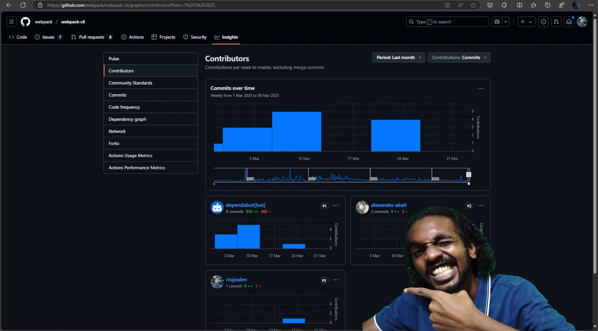
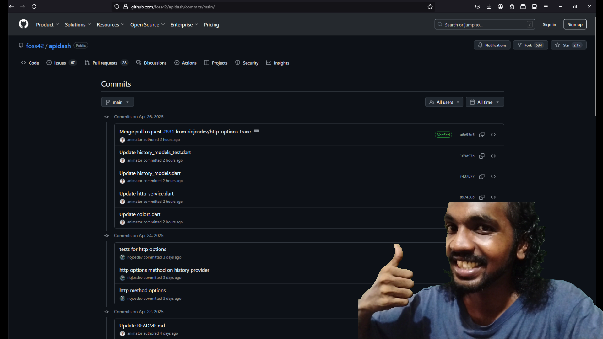

# My Three Proposals Were Rejected. But I Learned How Different OpenSource Organizations Accepts A Contribution From The Community

[^webpack-contributor]

[^webpack-contributor]: Myself, Rio Jos pointing myself part of the opensource contribution to Webpack's CLI. - "A small step for a Developer, a huge leap for Rio"

> First of all, I'm not making any promises, on what I will be doing for the next GSoC. I am not sure what the future would be like. And if I would do GSoC again.

For those who haven't heard about GSoC or Google Summer of Code; it is an annual program by Google that rewards contributors who successfully completes an opensource project idea contribution. Many opensource organizations take part in this program. They list different project ideas they want to integrate onto their opensource projects. Contributors finds interesting project ideas, and submits a proposal describing the implementation plan. And once a suitable proposal has been selected the person responsible for the proposal gets the opportunity to be mentored and work on the opensource project, implementing the project idea they made the proposal for. Google even awards the contributors with a stipend for their contribution.

And this GSoC 2025, I also took part. I submitted 3 proposals in total. Learning and getting familiar with the projects internals within the timeframe. I wanted to test my abilities of programming. I wanted to know how fast can I get familiar with a large opensource project. And make a meaningful contribution. 

What I blog about here is about my thoughts of my attempt. Me finding an appropriate organization and wanting to dedicate my time to improve their project. The lessons I mention here are useful for contributors and maintainers of OSS.

## Selecting the organizations and finding an interesting project idea to work on
After hearing about the announcement about the selection of organizations that were selected for this year's GSoC, I started focusing entirely on picking one project and start dedicating my time for the contribution. But multiple organizations, projects and ideas grabbed my interest.

I was already looking into the GSoC organizations before the announcement. I wanted to find an organization that I would want to be part of. My first list of interested organizations to contribute to was not at all the same after the announcement. I made a list of the interested organizations I wanted to contribute to, and labeled them based on my own desire to select them. For me it was mostly the curiosity to learn a new and exciting tool. Being able to work with a tool at it's maximum potential. 
> TBH, projects that I make myself, don't have that ability. The level of potential of the tools I use on my own self made projects, is relative to my own knowledge and planning of it, which is very limited. Opensource projects expands this, which is one of the main factor that makes me really appreciate opensource.

Also, being able to be a part of an opensource project is overwhelming, but some projects ideas had some barriers and different levels of motivational factors. It kind of made seem the time dedication would result in less rewards. As I write this now, I realize and want to advice to any future contributors to OSS to take on project not because of what reward you will experience working on it!
> The reason you should be following, it is not something that I can describe because it depends on a lot of variables (personal preferences, accessible resources and knowledge). Just remember don't rely solely on the rewards you will gather & consume, when you contribute your time onto the oss project and the idea to be implemented. But do be aware, so you can make more reasonable decisions.

For me feeding my curiosity was an incredible driving factor that made me choose the organizations and the project ideas. The tools I would be using and the technical information I will be processing for implementing the idea.

Every moment I focused on a single project, trying to learn the internals, evaluating the project idea, getting familiar with the contribution workflow and community interactions; my thoughts were pulled away from one project to another. It was a game of comparision that was happening in my head. Learning to focus and having a system for prioritizing my workflow, is the lesson I gained here. 
> Understanding my desires that drives me (mostly while learning the internals & getting familiar with tools) and the solution that "kept me awake" most recently were how I prioritized.

## The 3 Organizations I decided to get familiar with
**Different organizations have their own unique project management strategies** they have developed over the period of their existence. Working on multiple opensource organizations and their projects simultaneously gave me an insider perspective on how different opensource projects are maintained. And why they do things the way they do. 

Learning about the different workflows of these projects made me want to bring some of the techniques used in one organization to another for transfering similar improvements. But the fact is bringing about a change in the workflow is not an easy task. Even in an opensource project. There's an existing community & the maintainers that needs to approve and get familiar with the workflow. 
> But this was an opinion I had formed prematurely, since I had just started to learn more about these different organizations & getting into opensource contribution. I realized I had to wait to form a more informative and stable decision. I knew I had to get to know the community more, before I try suggesting a workflow change from a different organization.

**Learning the codebase** meant, I have to understand what the code written by the community is. Learning the entire internals was out of the question in the time period I have to submit the proposal, and make myself known by contributing some code into it. Focusing on fixing an issue is the way. So that I only need to focus on one particular part of the project. If I didn't find an issue to solve, I tried making an experimental change into it, so I understand atleast a part of the project. So, that I can find issues related to that part, and be able to come up with a solution for it.

### Webpack
#### Intro
We all know what webpack is. And for those who don't yet know, it is bundler that bundles up complex web assets into a module so that you can use them in your web projects.

#### Learning Curve
Learning to get comfortable with webpack codebase was the hardest of all. I was familiar with working with application development, but working with compilation was an entirely new concept. It was exciting and complex. Getting the opportunity to learn & think about different technical decisions based on the theoretical part of computation was thrilling.

#### Tip of the iceberg: Maintainer's Stress
As webpack was an big project, and had complex code. It was harder for many contributors. But many were soo enthusiastic to gain the opportunity to contribute to a widely known and respected project such as webpack. Even in the issues many commented how they feel they can solve the issue and requested to be assigned to them, but there were no plan to verify on how they can follow through. The maintainers who receives tons of these, often replied with to make a PR with their solution. I understood this decision of the maintainers was clearly calculated one. Assigning issues to people without knowing if they have would follow through with a solution, creates a technical debt; where the one who can potentially solve the issue would disregard the issue, as it seem the issue is already being worked on. (_Also see the section taken from APIDash's contribution guidelines [^no-assigning-issues]_)

> Many approach to solve an issue, requesting to assign them the issue. But in reality many are requesting for hand-holding, to solve the issue, because they doubt themselves and assumes they do not have the necessary prerequisites resources or skills. My suggestion is do a bit of research before asking to be assigned (asking to be assigned is not the way to take part in contributing to a project whose users are primarily developers. See [^assigning-issues-decides-the-direction-of-the-project]), or better just submit a PR.

#### My Initial Getting Started Process Workflow
* #### Hacking & Breaking the Webpack Internals (On Purpose)
    I started working on webpack by getting a forked clone on my local system. Initially I tried to make a change a config key name. I tried changing the `filename` key into a typo'ed one as `filenume`. It was a quick way for me to understand how different things were connected. I know this was a hacky way to get started. But going through the issues in the beginning, I was a bit confused. There were a lot of stuff I didn't even understand. I used webpack before, for my own projects. [My frontend library project - Jaggery](https://github.com/riojosdev/jaggery/), uses webpack. But learning how the internals worked were another thing.

    > I have my own devlog mechanism I follow to track what I do to understand, debug and contribute to a project. I save the devlog into a file with my own extension - `rubberduck`, so that I can find these devlogs later if I needed them. I have the history suggestion enabled on my powershell, so typing just a few characters denoting this script would suggest me this, and I make a few changes on the text, which then saves the current log with the current timestamp and appends it to the `rubberduck` file specified. I have to make a callable script to make it more easy to call.. though. 

    This is that powershell inline script I run to save devlog/rubberduck thoughts on doing a particular task.
    ```
    Get-Date -AsUtc >> "./project_name.rubberduck" && Get-Date -Format o -AsUtc && Add-Content -Path "./project_name.rubberduck" -Value @"multi line text here"@
    ``` 

* #### Webpack Internals Walkthrough
    I was able to learn more about the internals from this [talk by Sean Larkin - Everything's a plugin Understanding webpack from the inside out](https://www.youtube.com/watch?v=jFc898NTh5Q) on YouTube. After this talk, I had an immense respect for projects that had a plugin architecture built into it.

* #### Finding Out How The Contributers Solves an Existing Issue?
    I still wasn't able to know how an issue could be solved though. So, I looked into old PRs to know what changes were required to add a piece of modification to the webpack core. How people previously solved an issue. Some of the issues currently opened on webpack, had a long history of being closed and reopened. The issues was solved and they reappeared due to changes in the JavaScript ecosystem or it's dependencies. 

* #### Choosing an Issue to Work on
    I chose one of the issue and started going deep into it. Looking into the discussions, linked issues and PRs. I tried replicating the issue, so that I could be able to debug webpack internals locally on my system. But the issue I picked up, was not a beginner friendly one. It was an issue planned to be solved and released as a part of next major release. Multiple high priority issues were getting linked into this issue, I was trying to create a PR for. 

    I decided to come back again after creating a PR for a beginner friendly issue. I started recreating multiple issues, to figure out if it was solvable for a beginner like me. During this I found an issue with webpack-cli. Which was a quick fix. So, I made my first PR into webpack. And a few days later, it was merged! I was soo excited to see my contribution on an organization's project. That too one that I use the most for myself and the work I do.

### APIDash
#### Intro
APIDash is an alternative to postman or insomnia written in flutter/dart. As this being a developer tooling that I too would be a user of, I was excited to learn about the codebase and make a contribution to drive the project forward. Also being able to learn Flutter/Dart language was an additional motivational factor. Learning a new programming language and making yourself comfortable in a new workflow is an exciting journey. 

> I usually spend a lot of time getting comfortable in a new programming language before I tried to do complex stuff with it. But since the submission of proposal was within a timeframe, I had to push myself. It seemed overwhelming at first. You come across all those self doubts whether you are ready for working on a large complex problem, before you know how to work with the tool efficiently. But realizing that if a problem arises, where it seemed hard, that is the time when you actually need to learn. Learning before hand is what the industry drives us to. But encountering a problem, then dealing with it, is the only reality we need.

#### Assigning Issues Policy - The Contribution Workflow That Made Me Judge Other Orgs and their OSS Project
[^no-assigning-issues]: _The quoted text below was taken from [APIDash's contribution guidelines](https://github.com/foss42/apidash/blob/main/CONTRIBUTING.md#why-we-do-not-assign-issues-to-anyone)_

> Why we do not assign issues to anyone?
> * By not assigning issues upfront, anyone can feel welcome to contribute without feeling like the issue is already "taken."
> * This also prevents discouraging new contributors who might feel locked out if issues are pre-assigned.
> * Contributors are encouraged to pick issues that align with their skills and interests. To take initiative rather than waiting for permission or being "assigned" work.
> * Sometimes contributors express interest but never follow through. If issues are assigned prematurely, others might avoid working on them, delaying progress.
> * Leaving issues unassigned ensures that work can proceed without bottlenecks if someone goes inactive.
> * Open issues encourage community discussion and brainstorming. Prematurely assigning an issue can stifle input from others who might have better ideas or solutions.
> * As open-source work is often voluntary, and contributors' availability can change. Keeping issues unassigned allows anyone to step in if the original contributor becomes unavailable. This also supports multiple contributors collaborating on larger or complex issues.

#### My Initial Getting Started Process Workflow
* #### Having the prerequisites setup, learning prerequisites basics & following through the setup guide in the docs
    Starting with APIDash, I had to install Dart/Flutter on my system. I never used Flutter before. I went through a beginner tutorial from the [docs.flutter.dev's write your first app](https://docs.flutter.dev/get-started/codelab). Setting up my system to be able to develop Flutter/Dart programs. Once I got the tutorial done. I went ahead and followed the setup readme file from APIDash, and started setting up APIDash on my system. I had a few troubles here and there, but I was able to follow through, with some Googling and some help from StackOverflow, obviously.

* #### Finding an Issue
    I looked into some of the issues, going through the discussion in them. For the GSoC project idea (I was preparing my proposal) to be fully implemented, some prerequisite features were needed to be implemented using `openapi_spec` package. And I decided to go through with that issue, realized it would help me understand the part of the codebase, where I would be working most of time for the project idea.

    > You don't need to learn the entire codebase at day 1 or later, for making a meaningful contribution or changes. Be familiar with the part where you want to work on. The need to learn the entire codebase for any purpose is a waste of time. It's possible in smaller projects, but as the projects gets larger. You just have to trust, your programmer guts.

* #### Making the PR
    The documentation was a bit incomplete, compared to other flutter/dart packages. But I tried to use the package anyway. Going through some of the example project currently using the package in production. And referencing some forked repositories. I also had my own simple sample project to work with the package. The task I was doing was to import OpenAPI spec file and display the requests appropriately in APIDash. With some going back and forth, I was able to do it. Some sacrifices were made, regarding the versioning, but I had a workable demo. I did make a PR, marking it as a draft to APIDash. 

    Some additional issues were made regarding this draft PR inorder to be able to support the latest release of `openapi_spec` package. As per the request of the maintainer I explained how the additional issues were related to this PR, as a code review comment on the start of the line where the buggy code was. I had a doubt if the code review comment I made, make the PR seem like it was already reviewed. Only if the PR is only judged based on the Github labels/tags.

    During the development of the OpenAPI spec import feature, I found out some extra areas of APIDash that were missing support. Specifically HTTP `OPTIONS` and `TRACE` methods. I made a PR adding support for `OPTIONS`, which was merged into APIDash.



### Open Healthcare Network
#### Intro
Open Healthcare Network is an organization that focuses on building the tools for improving the healthcare systems. I had my eye on this organization before I got to know OHC was part of GSoC 2025. I believe I started following up on OHC through some posts by some of the mutual communities I follow like Kerala Startup Mission, Technopark Trivandrum mentioning their efforts in opensource, these communities where centered around where I lived. And being able to work on them, seemed like an incredible opportunity.

#### Why This Org
I realized I could too, contribute something meaningful. Being part of a community & learning about the medical industry during this process is what really drived me here.

OHC's Care application was built using Django and React. 

There were a lot of projects ideas put forward by OHC. I had my eyes on multiple ones. I was excited to form up a plan for each project idea implementation. The tools I get to work with was what got me excited. I was able to learn a lot of different technological innovations put forward by the Indian Govt & the opensource tools in the medical indutry. Following up with OHC meant, I would be able to get familiar with these technological innovations and being familiar with the medtech domain.

I was familiar with the tools, and me being able to know more about their impacts from the mutual community we are in, meant I would be able to provide more meaningful and impactful contributions.

#### My Initial Getting Started Process Workflow
* #### Having the prerequisites setup, learning prerequisites basics & following through the setup guide in the docs
    

    Setting up OHC's CARE application was a bit hard. I was already familiar with React, but Django - I had never fully did a project in it. I followed the Django documentation to build a simple application, to get familiar with Django architecture. Once I did that I started figuring out how the structure was different to a simple django application. Since this was a large project, it had more complex architecture. It was exciting to compare and learn about the architectural decision made to build and maintain OHC's CARE app.

* #### Finding an Issue
    Honestly, I had trouble finding an unassigned issue. A lot of the issues that I had the confidence that I could solve, were already assigned. 

    [^assigning-issues-decides-the-direction-of-the-project]: At the moment of writing this, I had put forward [my thoughts on the assigning of issues prematurely in the OHC's slack chat](https://rebuildearth.slack.com/archives/C01035FT0P5/p1747191369558129?thread_ts=1747133807.670409&cid=C01035FT0P5). In hopes of figuring out a solution for myself, to be able to find and solve issues smoothly. I was concerned heavily on the my productivity part of being able tackle the issues, i.e, I have to go through each issues and find the assigned person, and look into the current work/PR they are doing. And judge if it is a solution I could do better within a lesser time frame.

    > UPDATE: After the discussion of their intentions of their decision in working with the assigning of issues, also going through [the referenced article that solidifies their decision](https://world.hey.com/dhh/open-source-is-neither-a-community-nor-a-democracy-606abdab), I am also being able to agree with their decision. 

    > UPDATE 2: My judgement of their decision in letting an issue to be worked on only the person assigned to. Was coming from the previous projects (APIDash & Webpack). But after a discussion with OHC and APIDash, I was able to come to a stressfree conclusion, for my concern of productivity for the opensource contribution workflow. 
    >
    > The main fact is that, the OHC is primarily an opensource organization that targets the medical industry. And me, an enthusiastic programmer is not familiar with what the medical industry user experience should be like. The other two projects were primarily a developer tooling. And in that case, I was extremely familiar and had my own ideas to provide, as I was one of the user they targetted.
    >
    > When assigning the issues, the community gets limited ability to decide the direction of the project, and it is necessary, considering that the majority of the contributors were not familiar with what the UX should be. And more PRs that work disadvantage to the medical industry UX, would have been made. Which just cost too much tech debt for the maintainers to solve. The other projects, as it is developer tooling project, the UX can be decided by the majority of the contributors, as they are programmers primarily, and they do know what and how they prefer to work a tool to improve their own productivity.

    Anyway, since I didn't find an existing unassigned issue during the proposal & contributor announcement period, I tried to find if there's any issue in the CARE application during my own usage. This way, I can create my own issues and solve them before it gets assigned to someone. When I ran the tests, I was able to find an issue that caused the test to fail. I decided to take this opportunity to solve them. 

* #### Making the PR
    > I chased the bug, using different grep tools. In my neovim IDE, I use the telescope plugin which utilizes ripgrep to find files/code. Which helped in tracking down the code where I need to be working on. I can't convey & be thankful enough, on how useful the search functionalities present in different IDEs are.

    I started with the frontend application, chased the root issue. Which went beyond the frontend, and into the backend application. Looking into the backend application, I then found it was because of the improper import of data. Once I found the issue, I started making a PR, that solves this issue and made necessary changes to be able to migrate back, if needed be. 

    The PR I made, was not a prioritized issue at the moment of my submission, so it was closed for the time being without merging. Here too the UX of the CARE users was in question. But, I was now able to work on the entire CARE application. I was familiar with the codebase better than before I got started. So, the fact my single PR didn't demotivate me that much, as I had the opportunity to make a better and yet impactful PR. And after writing up this article, I can say I am able to make and choose how I tackle an issue. I hope to align with the community better. Let's see.

## Some Hard to Swallow Advices for my Fellow Contributors
* Getting started seems overwhelming at first. But just follow through.
* Try setting up the project in your local environment as early as possible. The project idea and the project itself may seem irrestible at times, and sometimes you may encounter issues in setting up the project in your own machine. So make sure you are able to run it on your machine before deciding on writing up the proposal.
* A lot of people are in this program, so you may see others trying their level best to along side you, there are many contributor behaviors you might encounter. Good and Bad. Many lose focus here, probably because of an external influence outside of the scope of your opensource contribution. So, focus on getting to know the project's codebase, instead of depending a lot on handholding. Yes, I've to call it as such. Because this is one of the biggest turn off in getting selected. The stigma of being a noob/beginner is there, but to ask for guidance for a simple thing is tiresome. Do your part and until you've exhausted all your options, do not ask. But everyone does not do the same thing. They ask for guidance even before they try to find the answer themselves. If you do this, you are wasting your opportunity to learn how to deal with issues and you are wasting the time of the person (maintainers & other contributors) who were willing to help you. Please don't play this game, and also please don't get played too. Again, exhaust all options to find the answer before trying to ask for help. Start with google, then move laterally towards the documentation. You may even find the answers in their official chat. Remember you are probably never the first person to experience the issue you encountered. But don't ask for it, search for it. You need to have the necessary searching skills, if you want to part of opensource or to tackle any large project.
* The current tech landscape made people get accustomed to one click install. Which is different when coming to the opensource. Where we are actually the tinkerers of the project. So get our hands dirty and go on the adventure of setting it up. 
* People try to ask for simple help for many reasons. Since this is GSoC, one of the main reason is to form an emotional bond, to increase the chances of getting selected. It is one of the things we learn. Forming friendships. But in the end it is not about your efforts where you invested in for emotional connection. It is always code. Show the work you done. GSoC is not a place for you, to cure your loneliness.
* One of the advices I seen everywhere about GSoC is that, "when in doubt ask the community". But you have to know how to ask your doubts. One of the most common and annoying mistake is that people ask the project maintainers and other community members about an issue they come across, without even investigating themselves about it. They do not even try to find similar issues, which causes a techinical debt for the maintainers and others who try to help them. So please do your own research, and bring your own reference materials.
