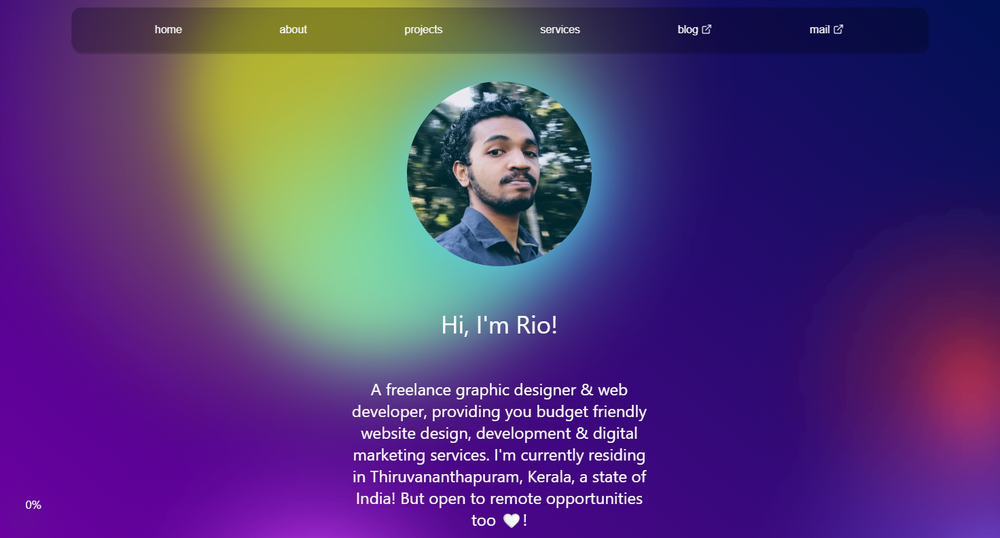
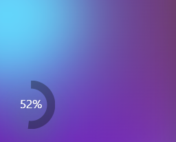
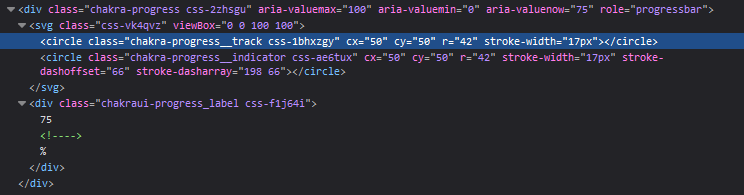
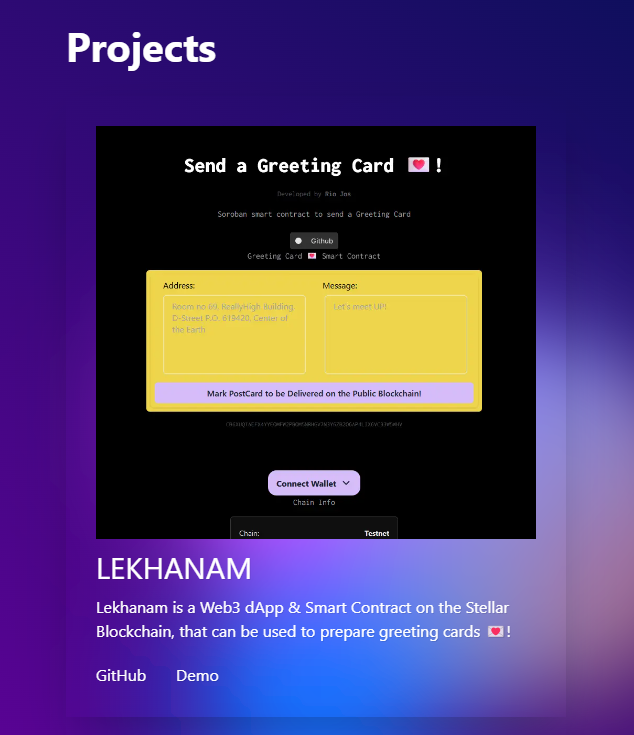

# Portfolio Redesigned using NEXT.JS with TailwindCSS, ChakraUI & a Morphing Gradient Background

So, just wanted to prepare a devlog about my redesign of my portfolio website.

**
Let's go into the behind scenes of how I redesigned my web-app development & graphic design webpage, riojos.in. Built using NEXT.JS, TailwindCSS, ChakraUI & a Morphing Gradient Background by WeCoded's Youtube Tutorial. I deployed the final webpage on Vercel! Let's go into more depth on the development.
**

## A Constant Frontend Framework for A Consistent Portfolio Progression
My decision for the redesign started when I wanted a page to showcase my projects & also to represent my tech journey.

### Before the Redesign
My last design had only just an user interface with some simple HTML div elements, CSS & an incomplete skeleton [GSAP](https://gsap.com/) animation of a section where latest updates would be shown. 

I thought to show some blogs I written in that component. But that would've meant I would be skipping my opportunity to develop some projects to showcase my skills. So participated in a hackathon to get that pressure to build & ship fast. I built a Web3 Dapp which is [listed on my portfolio](https://riojos.in/showmecode) or go through the [repository for Lekhanam dApp on GitHub](https://github.com/riojosdev/lekhanam4stella), you could maybe even play with the [demo which is deployed onto the Stellar Blockchain TestNet](https://lekhanam.vercel.app/). Some developers work well under pressure, like me. Not good behavior, I know. But I usually get distracted. This blog is a way for me to keep me accountable at times of need. 

> In this era aren't we all living in the attention driven economy. And we all do experience ADHD from time to time, I guess. Some cope well better than others. Or seems to be.

Unfortunately, that component went underdeveloped for so long, as I didn't have any cool/fully finished projects to show on my portfolio. It's not that I didn't have any projects to show for, but my skills when I first started and where I'm now is entirely different. The plans I had when I first started wasn't recognized much. So, everytime kept trying to reimplement my portfolio. Over and over again.

### For Ease of Development: The Infinite Choices for a Frontend Framework
If I had a constant layout or a tech stack. I would have sticked on to it. But everytime it get's changed. And almost everytime I wanted to reimplement my portfolio on different tech stack. 

> JavaScript always had some new cool framework, that spoke about the next thing that felt like it was here to stay and be in the game for the long run. But as I was just starting in this tech I blindly believed in that.

This domain have been hosted on different tech stack. First it was just **plain HTML/CSS/JS**, then later rebuilt using **PHP's Laravel framework**. As the server got expired I had to migrate my Laravel page **back to just a static page with HTML/CSS/JS**. Then tried out adding this as a custom domain for my **Hashnode blog**, later **Tumblr**. Still wanted to implement a lot of features as my development skills were getting better, I was too excited to try out some cool things I learned. I wanted more freedom and control of how my page is looking. Implemented a minimalistic page using **again HTML/CSS/JS** speaking about my services and where to find me - socials and email. This was the last stack I had been using before my current redesign implementation, that is with **React's NEXT.JS**.

> It was not about finding a permanent tech stack, but to have a devops system in place to keep trying out new tech stacks. 

### My Own Frontend Design System: Jaggery
So as the tech stack was getting evolved day by day, it was hard to keep reimplementing my entire page on the latest tech stack. So I started a opensource project [Jaggery](https://www.npmjs.com/package/jaggery). To be able to import different components from different Frontend Frameworks. That way I have a chance to test out the framework as well as, not stress too much about the next framework that gives me a FOMO for not using it's coolest, awesome-est, modernest, never before seen, new features.

[Jaggery](https://www.npmjs.com/package/jaggery) is released as a monorepo component library on NPM, where different components get's built using different frontend design frameworks and anyone could just add them to their plain HTML/CSS/JS page.

## Portfolio Redesign: The First Frontend Components
### NavBar

The NavBar component is primarily built to be imported into a create-react-app project. I built this component and published it onto my [NPM Jaggery Library](https://www.npmjs.com/package/jaggery). I had some issues on getting it directly imported into the NextJS portfolio project. 

I wanted to implement the portfolio first as I wanted to keep my presence alive during the development. So, I tried extracting the component and implementing it directly onto the NEXT.js project. Else I would've let my domain point to a broken, incomplete page where there was nothing exciting to make the user curious about my dev journey.

### Morphing Gradient Background - by WeCoded's YouTube Tutorial
The main attention driving factor to my portfolio is from this [background interactive Morphing Gradient animation tutorial by WeCoded's YouTube Channel](https://www.youtube.com/watch?v=Ml-B-W91gtw). On his tutorial I learned about how you can apply shaders using HTML SVG elements. I immediately got hooked on it. And since it looked really well on my portfolio.

I want to do more research on it & also share with you guys. So I have started planning a course on XR (AR/VR/MR) & it would start with the HTML SVG elements. Will be posting soon a link about it. Make sure to follow me on any socials you can find on my portfolio page to stay updated on when it would be available.

### Scroll Progress Circular Tracker

The idea for a scroll tracker was inspired by my friend's blog page 😉. I used [ChakraUI](https://v2.chakra-ui.com/) to implement the their [circular progress tracker](https://v2.chakra-ui.com/docs/components/circular-progress) design. Added a custom CSS on top of ChakraUI's component, as I had some issues in getting my desired CSS Style to be applied using ChakraUI's CSS styling configurations.

#### How I added custom CSS styling on top of ChakraUI's predefined styles
I just opened up the browser dev console and looked at the CSS classes ChakraUI has defined. I tried adding my own style changes directly in the dev console to see what element was getting stylized. Found out that a custom svg element defined by ChakraUI and a seperate div element to represent the text was the classes I needed to change the stylings.

[^note]: The image above shows the CSS styles defined by ChakraUI. The ones I wanted to use were `chakra-progress__track` & `chakra-progress_label`.

I just then need to define in my NEXT.JS project for the scroll component the appropriate CSS styling. I also found that due to how my custom CSS was getting loaded, my styling was being overwritten. Which I was able to find another way by just adding the `!important` rule next to the CSS property I changed. PS. I defined my CSS styling for this particular as a global CSS style in the NEXTJS layout file.

### Card Container Components

The different [card container components from ChakraUI](https://v2.chakra-ui.com/docs/components/card/usage) were used to represent a section. Which was built & stylized using [TailwindCSS](https://tailwindcss.com/). Additional CSS styling were also added on top of ChakraUI to match the whole theme of the Portfolio page.

## Glimpse into the content of the Pages
### About
[The about page](https://riojos.in/whoami) has a brief description about my journey into freelancing. How I started programming. What are my main motivations, lessons & things like that. Do give a read to get to know more about me.

### Projects
I listed my own ideas on [the project page](https://riojos.in/showmecode) that I tried to get my hands dirty. It shows what I really would do. And what all I have learned. The opportunity of each project is different. It gives you an idea, of what is possible with me contributing. And what my project is able to do. Don't let the projects go unseen, as they have immense potential to create a big dent in this tiny blue planet. But to take it forward, you would need to love dirt.

### Services
On the [service page](https://riojos.in/needhelp) most services requested from me. These are not my only capabilities, I can provide, but since these are the most often things, requested from me. I added it so you can reach out to me easily. Describing more would just mean, I would be forcing my ideas on to you. We all live in & come from different dirt on this planet, no?

## Server Actions & Middlewares
Postgres Storage on Vercel powered by NeonDB
I used PostgreSQL as the database by following the [Vercel Postgres Storage QuickStart](https://vercel.com/docs/storage/vercel-postgres/sdk). Vercel let me have an easy to use dashboard to be able to monitor postgres data. I used it for the enquiry form on my portfolio.

The form which queries the database is built as a client component which calls a server action to interact with the database. Also I learned that you can only call these server actions in form actions, event handlers & React's useEffect hooks. This is actually cool and at the same time grinds my programming gears. You can [read about NEXT.JS server action docs on Vercel](https://nextjs.org/docs/app/building-your-application/data-fetching/server-actions-and-mutations#behavior)

## NextJS Redirect
The NEXT.js config file had an option to make a redirect towards an address. I wanted to use it for having an fancy human readable URL format, rather than something that was too long to even be visible in the browser address bar. The shorter URLs makes it more memorable. So loved that NEXT.js offered it directly on it's config.

But before getting to know the option of redirect from the NEXT.js config, I tried implementing a server action to redirect the page. So that I may be able to display a loading animation that the user was being redirected towards an external link. If I could've been able to implement that, I could've used the meta tags and log the visit directly on my NEXT.js portfolio.

I don't know if this is not possible or not, but the data couldn't be SELECTed and received on the client component even with the an external server action. The redirect function was defined in the client component inside an useEffect hook. So I wanted my data to reach the function call inside useEffect. But the SQL query as it is always async, it returned a promise. And it was not possible to get the value of the promise. I was hacking my might's off on this. 
