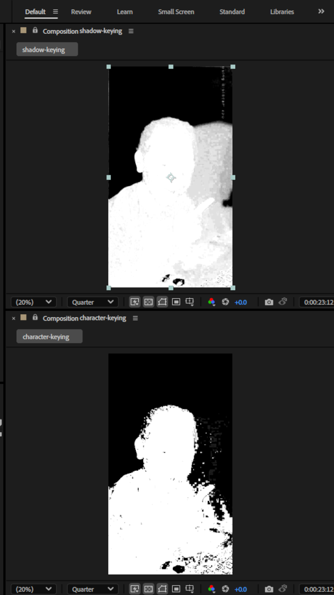

# Shadow Isolation

Working with shadows is a tough job. It seems really cool to have shadows on your composition. And in the case for video capturing, the raw footage, when it have shadows the overlay on your subject or environment, it means the assets you are going to integrate later, would also need to follow the same shadow rules. Shadow follows the lighting, I'm not talking much about lighting because shadow is a pain in my a**. Talking in the workflow of Lighting doesn't make me notice it much. 

So, now here I am. Trying to keylight my footage into two separate layers, one for my character and another one for my shadow. So that I can apply various effects so that the shadow would have more realistic placement on the environment. I'm thinking of shaders. Need more info as we progress if I really need something more advanced like shaders or if I can work with something more simple & dumb down tech.

## What is Matte separation?

## Issue: Keying has missed portions when the character and the shadow both have the same level of dark colors.
The keying picks either lesser or more of the character and shadow. Which is a bit unnatural looking. But almost 95% of the time the changes are not visible to the naked eye. As the problem happens in the darker regions. Making the footage more brighter and doing matte separation & refinement makes it more easier.

When I try to key out the shadow, the green screen also gets included.
When I try to key out the character, the shadow also gets included.
When I try to key out the green screen, which is the character and the shadow, I could do it nicely

Whatever I try to do, the shadow still persist.

## Resources
* https://www.dvxuser.com/threads/green-screen-keying.373811/
* https://android.stackexchange.com/questions/62737/list-of-supported-a-v-and-image-codecs
