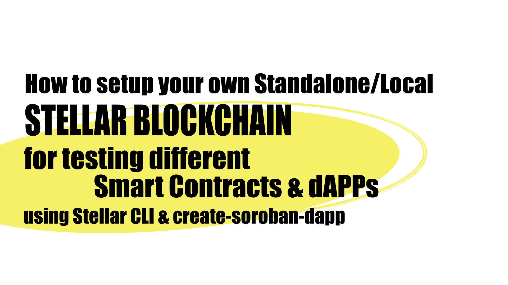

# Setup your own Standalone/Local Stellar Blockchain to test different Smart Contracts & dApps
<!-- Smart Contract & dApp Development & Deployment using Stellar CLI & create-soroban-dapp -->


## Introduction to Stellar Blockchain
Stellar is an opensource decentralized blockchain. The Stellar protocol is supported by Delaware nonprofit corporation and the Stellar Development Foundation. It's founded by Jed McCaleb & Joyce Kim.

The tutorial or walkthrough, to be specific; is something I developed during the Hackathon challenge by Stellar on [dev.to](dev.to). You can follow either the video or this article, to setup your own standalone/local Stellar blockchain on your system.

> Note: You need to have a minimum of 8GB RAM to run a whole Stellar blockchain validator.

<iframe width="560" height="315" src="https://www.youtube-nocookie.com/embed/Sa6P1GE7aoE?si=ZdgBEjqJnVZXbYfp" title="YouTube video player" frameborder="0" allow="accelerometer; autoplay; clipboard-write; encrypted-media; gyroscope; picture-in-picture; web-share" referrerpolicy="strict-origin-when-cross-origin" allowfullscreen></iframe>

## Why run your own Standalone/local Stellar Blockchain
 Once in while we try to test funny messages, just to see how it would look like. During development we often type in different embarassing/funny statements to have a fun at it. We crash a lot when we hack. Often times the users would able to experience this. And might come up to the conclusion that we are just playing with the dApp, and are not dedicated to provide a dedicated service. 

<p id="meta_descriptionz">Aren't you tired of different embarassing mistakes people might see when you are developing the blockchain. With this tutorial you can have your own blockchain setup!</p> 

Where you're able to experiment with different styles of smart contracts and test them without fearing the public eyes. So, let's get started shall we?

## Setting up your development environment
In order to run a basic Stellar blockchain validator node and prepare your device for the build & development of smart contract and a dApp, you need to have certain prerequisites. For following with this tutorial or walkthrough you need to have the Rust toolchain, an editor that supports Rust development and Stellar CLI.

### Install Rust
#### Linux, MacOS, or other UNIX-like OS
You can install Rust by running the following command in your favorite terminal
```bash
curl --proto '=https' --tlsv1.2 -sSf https://sh.rustup.rs | sh
```
#### Windows
For Windows devices, you can download the [rustup-init executable from rust-lang.org](https://static.rust-lang.org/rustup/dist/i686-pc-windows-gnu/rustup-init.exe) and follow the instruction to proceed with installing it. 

> Note: If you are using WSL or WSL2, you can follow the instructions for Linux, to install Rust
#### Other
For other methods of installing [Rust](https://www.rust-lang.org/), see: [https://www.rust-lang.org/tools/install](https://www.rust-lang.org/tools/install)

### Install the target
And once your have Rust set up. You need to be able to compile a WASM binary using Rust. For that you would need to configure rustup to install the `wasm32-unknown-unknown` target.

Run the following command in your terminal of choice to install the `wasm32-unknown-unknown` target.
```bash
rustup target add wasm32-unknown-unknown
```

### Configure your Editor/IDE
Rust is supported by majority of editors. You can follow [https://www.rust-lang.org/tools](https://www.rust-lang.org/tools) setting it up for your favorite IDE.

I'll be mentioning about VS Code, as it the one I was using at the time I was writting this tutorial. In a later article, I might provide the development setup for NeoVim. As I often use NeoVim to have a more comfortable environment to code.

#### VS Code
* If you haven't already installed VS Code, you can do so by [downloading VS Code](https://code.visualstudio.com/)

* Install [rust analyzer extension for VS Code from the Marketplace](https://marketplace.visualstudio.com/items?itemName=rust-lang.rust-analyzer).
  
  Which is an implementation of [Language Server Protocol](https://microsoft.github.io/language-server-protocol/) for [Rust](https://www.rust-lang.org/) programming language. It provide a lot of useful features for your development in Rust, such as code completion, syntax highlighting, inlay hints, etc. You can checkout the [manual of rust analyzer](https://rust-analyzer.github.io/manual.html) to know more about it.

* You would also need [CodeLLDB debugger extension](https://marketplace.visualstudio.com/items?itemName=vadimcn.vscode-lldb). It helps you to debug your Rust code, by providing various debugging information and features like stepping through code, applying breakpoints, logpoints, etc.

### Install Stellar CLI
Stellar CLI is a command line tool that helps you to run & deploy your Soroban smart contracts onto different networks of Stellar blockchain. Whether that be testnet, futurenet, mainnet/pubnet or the standalone/local. We would be using Stellar CLI mainly to ease our development & deployment of our smart contracts.

Install the latest version from source:
```bash
cargo install --locked stellar-cli --features opt
```
Install with cargo-binstall:
```bash
cargo install --locked cargo-binstall
cargo binstall -y stellar-cli
```
Install with Homebrew:
```bash
brew install stellar-cli
```

<!-- TODO: * Autocompletion for stellar cli -->

<!-- TODO: ## Stellar CLI Basics
### Network configuration
* Different types of network
  * testnet
  * mainnet/pubnet
  * futurenet
  * standalone/local -->

## How to run your own Stellar blockchain instance, also called standalone/local?
You can use the [Stellar Quickstart Docker image](https://hub.docker.com/r/stellar/quickstart) to run your own instance of Stellar. You can follow the instructions in the [readme to learn more about the quickstart image](https://github.com/stellar/quickstart).

We will be using the testing tagged image for our development environment.
* Start Docker & run 
    ```bash
    docker run --rm -it \
      -p 8000:8000 \
      --name stellar \
      stellar/quickstart:testing \
      --local \
      --enable-soroban-rpc 
    ```
    This will start a quickstart container of Stellar blockchain instance and display the status logs of the standalone blockchain instance. You will also see information about the Public and Private keys. Take a note of them, as we will be needing them later on.
* You can check the status of the instance, by querying the Horizon API like so:
  ```bash
  curl "http://localhost:8000"
  ```
  you can also use your browser, if you prefer your browser over curl.

### Configuring network & identity using Stellar CLI
In order for us to interact with the standalone/local instance of the Stellar blockchain using Stellar CLI, we need to configure the information about the network to be used by the CLI.

* Add a network and define the RPC URL & the network passphrase
  ```bash
  stellar network add local \
    --rpc-url http://localhost:8000/soroban/rpc" \
    --network-passphrase "Standalone Network ; February 2017"
  ```
  This will create a `/.soroban/network` directory in our root directory we are currently in, with our network configuration we just defined.
* Next, we need to create an identity we would be using, to deploy the Smart contract onto our blockchain instance. Run the following to create an identity called `alice` for our network.
  ```bash
  stellar keys generate alice --network local
  ```
  Stellar CLI would generate an identity inside the `.soroban/identity` directory and funds it using the friendbot.
* You can retrieve the address of the identity we just defined using the Stellar CLI by running the command
  ```bash
  stellar keys address alice
  ```

## Using the create-soroban-dapp boilerplate to implement a dApp quickly
The `create-soroban-dapp` by Paltalabs is a boilerplate dApp for kickstarting your ideas. It's much similar to the `create-react-app`. To setup create-soroban-dapp follow the steps below.
* Visit [create-soroban-dapp on GitHub](https://github.com/paltalabs/create-soroban-dapp) and clone the project on your system.
  ```
  git clone https://github.com/paltalabs/create-soroban-dapp.git
  ```
<!-- ### create-soroban-dapp folder structure
* contract
* src/... => react
* readme
* config files
* deploy files -->

### Initialize create-soroban-dapp
First cd into the directory `soroban-react-dapp` inside our cloned `create-soroban-dapp` folder.
* To set up `.env` file according to the `.env.example`, run
  ```bash
  cp contracts/.env.example contracts/.env
  ```
* Copy & paste the `ADMIN_SECRET_KEY` to .env file. You can find them in the standalone blockchain container logs, we ran using the docker container stellar/quickstart:testing. It is a key that starts with `S`. 
* And for the `MAINNET_RPC_URL` give the following
  ```
  localhost:8000/soroban/rpc
  ```
  The final `.env` file contents should look like the following
  ```
  # Stellar accounts Secret Keys
  ADMIN_SECRET_KEY="SC5O7VZUXDJ6JBDSZ74DSERXL7W3Y5LTOAMRF7RQRL3TAGAPS7LUVG3L"

  # RPC Setup
  MAINNET_RPC_URL="localhost:8000/soroban/rpc"
  ```
> Note: You might have noticed that the secret key is exactly the same. This is because the docker quickstart image is configured with a fixed root account.

### Compile & Deploy the Smart Contract onto the standalone/local network
* From the `soroban-react-dapp` directory run the following one by one. This will install the packages and build `soroban-react-dapp`.
  ```bash
  yarn
  cd contracts/
  yarn
  yarn build
  ```
* `cd` into the `greeting` directory inside the `contracts` folder & build the Smart Contract to WASM using cargo.
  ```
  cargo build --release --target wasm32-unknown-unknown
  ```
* Next we would be deploying the smart contract to the quickstart Stellar blockchain container via our predefined standalone/local network.
    ```
    stellar contract deploy --wasm target/wasm32-unknown-unknown/release/greeting.wasm \
    --source alice --network local
    ```
    The CLI will output a contract address of the deployed WASM Smart Contract. Copy it.
* In the `contracts` folder, you'll find `deployment.json` file
    ```
    [
    {
        "contractId": "greeting",
        "networkPassphrase": "Standalone Network ; February 2017",
        "contractAddress": "CAQLKKFSEOJF0932JGVF43NVCI3JDJKLEFFJSEJFLSEJFJ09233LKKFJJ"
    },
    {
        "contractId": "greeting",
        "networkPassphrase": "Test SDF Network ; September 2015",
        "contractAddress": "CDJOI4JFJ3FJDMX3I4HFJ4WF9JAVPIHLEKJ4GDNL34HGFHELKG90JKLSH"
    }
    ```
    Replace the contract address of the Standalone Network, with the contract address you have received during the deployment.
* You can now connect to the standalone network using the wallet of your choice. Just make sure you have configured to the wallet's network to the standalone Stellar network, with the following configuration.

  | Variable | Value |
  |-|-|
  | Name | Standalone |
  | HORIZON RPC URL | http://localhost:8000 |
  | SOROBAN RPC URL | http://localhost:8000/soroban/rpc |
  | Passphrase | Standalone Network ; February 2017 |
  | Friendbot URL | http://localhost:8000/friendbot |
  | Allow connecting to non-HTTPS networks | true |

* Now refresh the create-soroban-dapp in the browser. And connect your wallet with the network set to Standalone. The wallet will ask to fund your wallet using the friendbot. Confirm the request!
### Finalle
Submit a new greeting and sign the transaction. You shall see the updated greeting!

## Resources
* [Stellar Documentation: Getting Started](https://developers.stellar.org/docs/build/smart-contracts/getting-started)
* [paltalabs/create-soroban-dapp on GitHub](https://github.com/paltalabs/create-soroban-dapp)
* [Stellar quickstart docker image on DockerHub](https://hub.docker.com/r/stellar/quickstart)
* [Stellar CLI](https://github.com/stellar/stellar-cli)
* [Stellar Admin guide](https://developers.stellar.org/docs/data/rpc/admin-guide)